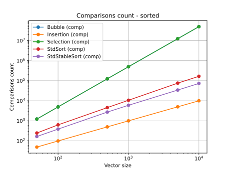

# PARTIE 1 - Implémentation algorithmes de Tri

Concernant la partie 1 nous devions créer les trois algorithmes de tri de base vu en PRG1 : à bulle, par insertion et
par selection.
Nous avons créé ces tris de manière générique pour pouvoir prendre en charge tout type de données. Ces tris ont aussi
été surchargé
pour prendre en charge des itérateurs ou des vecteurs.

- [Tri à bulle](../src/BubbleSort.h)
- [Tri par insertion](../src/InsertionSort.h)
- [Tri par selection](../src/SelectionSort.h)

# PARTIE 2 - Test des algorithmes de Tri

Cette partie consistait à créer un petit programme permettant de tester les algorithmes de tri que nous avions créé.
Voici
le resultat en console de notre contrôle :

```
BubbleSort test :
Unsorted vector : [1,-23,43,23,5,73,-32,56,2,24,0,76,-54,8,108,-3,237,42,-87]
Sorted vector   : [-87,-54,-32,-23,-3,0,1,2,5,8,23,24,42,43,56,73,76,108,237]
Is sorted       : true

SelectionSort test :
Unsorted vector : [1,-23,43,23,5,73,-32,56,2,24,0,76,-54,8,108,-3,237,42,-87]
Sorted vector   : [-87,-54,-32,-23,-3,0,1,2,5,8,23,24,42,43,56,73,76,108,237]
Is sorted       : true

InsertionSort test :
Unsorted vector : [1,-23,43,23,5,73,-32,56,2,24,0,76,-54,8,108,-3,237,42,-87]
Sorted vector   : [-87,-54,-32,-23,-3,0,1,2,5,8,23,24,42,43,56,73,76,108,237]
Is sorted       : true
```

# PARTIE 3 - Génération de vecteurs

Cette partie avait pour objectif de générer des vecteurs en fonction des paramètres d'entrée fournis.

## Génération triée (`GeneratorType::SORTED`)

Cette génération est simple, il suffit de rajouter les éléments 1 à 1 séquentiellement jusqu'à atteindre le `n`
souhaité.

```c++
std::vector<T> result;
for (size_t idx = 0; idx < size; ++idx) {
    // As we require a size_t constructor for the nearlySorted algorithm, we can use it here too
    result.push_back(T(idx));
}

return result;
```

## Génération inversée

Exactement la même solution qu'au-dessus, mais en décrémentant au lieu d'incrémenter.

## Génération mélangée

Afin de garantir le fait que chaque élément soit unique dans le vecteur, un vecteur trié est généré,
et en utilisant la fonction `std::shuffle(...)`, on récupère un vecteur mélangé.

## Génération presque triée

A l'instar des recommendation dans l'énoncé, une solution plus efficace est de générer les éléments séquentiellement
(un à un), et de rajouter un facteur afin de décaler légèrement la valeur de celle attendue.

Pour récupérer des résultats corrects, une distribution de déviation standard est utilisée, en fonction de la taille
totale du vecteur,
pour éviter les écarts trop grands pour un petit `n`.

# PARTIE 4 - Comparaison Tri - Temps

Concernant la partie 4 nous devions générer (grace à la partie 3) des vecteurs d'entier de plusieurs tailles. Nous avons
choisi comme tailles : 50, 100, 500, 1000, 5000, 10000. Nous devions créer 4 types de vecteurs : trié, inversé,
aléatoire
et presque trié.

Une fois les vecteurs générés, nous devions les trier avec nos trois algorithmes de tri et les deux de la STL. Vous
retrouverez
le code dans le fichier [main_part2.cpp](../src/main_part2.cpp).

Le programme test donc en premier par répartition des valeurs (génére un vecteur trié, inversé, aléatoire et presque
trié)
puis par taille de vecteur (génére un vecteur de taille 50, 100, 500, 1000, 5000 et 10000). Pour chaque combinaison de
repartition
et de taille, le programme test les 5 algorithmes de tri et enregistre les valeurs dans un fichier .csv.

## Vecteur trié

Pour le vecteur trié du plus petit au plus grand, nous avons comme résultat :


Cas particulier, car nous pouvons voir que le tri par insertion que nous avons implémenté se trouve être plus rapide que
les tris de la STL.

## Vecteur inversé

Pour le vecteur trié du plus grand au plus petit, nous avons comme résultat :


On voit bien que les tris proposés par la STL sont radicalement plus rapides que les tris que nous avons implémentés.

## Vecteur mélangé

Pour le vecteur réparti de manière aléatoire, nous avons comme résultat :


De la même manière que pour le vecteur trié inversé, les tris de la STL sont plus rapides que les tris que nous avons
implémentés.

## Vecteur presque trié

Pour le vecteur presque trié, nous avons comme résultat :


Nous voyons que jusqu'à une centaine de valeurs le tri par insertion est aussi rapide que les tris de la STL. Cependant,
à partir
après 100 valeurs l'écart se creuse radicalement avec ceux de la STL.

# PARTIE 5 - Implémentation de `OpCounter`

OpCounter est une classe avec deux membres statiques, l'un mesurant les copies faites avec ce type,
l'autre mesurant les comparaisons faites.
Afin de permettre cela, cette classe implémente les opérateurs suivants, et incrémente le compteur correspondant:

| Opérateur           | Compteur    |
|---------------------|-------------|
| = (assignation)     | Copie       |
| <                   | Comparaison |
| \>                  | Comparaison |
| ==                  | Comparaison |
| !=                  | Comparaison |
| ++ (post-Incrément) | ---         |

# PARTIE 6 - Comparaisons Tris - Opérations

La partie 6 est très semblable à la partie 4, la principale différence étant dans les valeurs récupérées.

## Vecteur trié
| Copie                                | Comparaisons                         |
|--------------------------------------|--------------------------------------|
|  |  |

Pour le nombre de copies, `std::stable_sort` est légèrement au-dessus du reste de la compétition,
qui reste groupée.

Tandis que pour le nombre de comparaisons, le tri par insertion est sensiblement plus haut que le reste.
Les méthodes de la librairie standard se font battre par une marge conséquente par l'implémentation maison du tri par
insertion.

## Vecteur inversé
| Copie                                  | Comparaisons                           |
|----------------------------------------|----------------------------------------|
|  |  |

Pour un vecteur renversé, les méthodes de la librairie standard ne sont battues que par le tri par
sélection uniquement sur le nombre de copies.

## Vecteur mélangé
| Copie                                | Comparaisons                         |
|--------------------------------------|--------------------------------------|
|  |  |

Comme pour le vecteur inversé, les méthodes de la librairie standard ne sont battues que sur un seul
de ces points de comparaison.


## Vecteur presque trié
| Copie                                 | Comparaisons                          |
|---------------------------------------|---------------------------------------|
|  |  |

Pour ce type de vecteur, l'insertion sort est légèrement plsu rapide pour un petit `n`,
mais grandit plus vite que les autres solutions.

Les fonctions de tri de la librairie standard semblent gagner dans la majorité des cas, uniquement battu
sur le nombre de copies pour le tri par selection.

# Conclusion

Comme remarqué dans les mesures faites, les solutions de tri de la librairie standard semblent être bien plus rapides
dans la grande majorité des cas.

