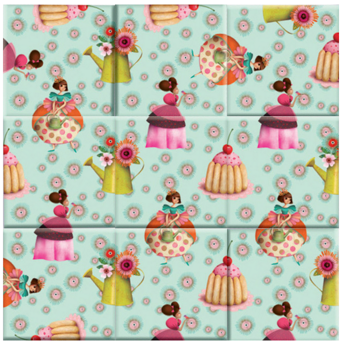
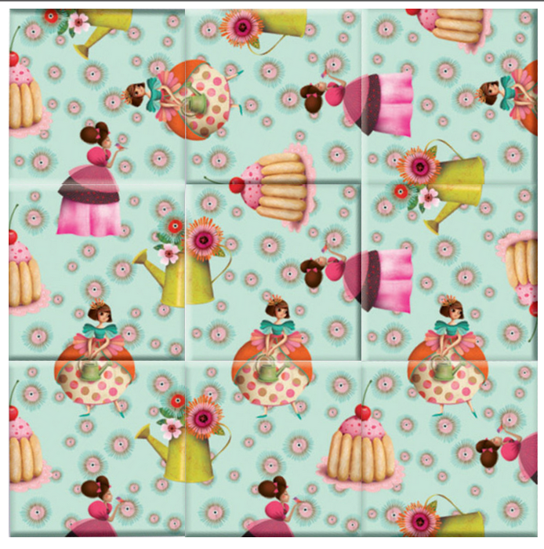

# Rapport

## Calcul des possibilités
Dans ce puzzle, nous avons 9 pièces en un **unique** exemplaire.
Sans prendre en compte les rotations, nous avons donc :

$$
(\text{nb pieces})! = 9\cdot 8 \cdot 7 \dots 2 \cdot 1 = 362'880
$$

Or, chaque pièce peut-être dans une des 4 rotations, nous avons donc :

$$
\begin{align}
P  & = (9\cdot 4)\cdot (8\cdot 4) \dots (2\cdot 4) \cdot ( 1 \cdot 4) \\
&= 9! \cdot (4)^9
&= 95'126'814'720 = 9.5 \times 10^{10}
\end{align}
$$

Mais un plateau peut être identique, mais uniquement tourné de 90°, le nombre de possibilités est alors :

$$
\begin{align}
I  & = \frac{9! \cdot 4^{9}}{4} \\
& = 23'781'703'680 = 2.3\times 10^{10}
\end{align}
$$

Ce qui nous laisse donc avec $23'781'703'680$ possibilités.


## Itérations du programme
Notre programme rentre $3776$ fois dans la fonction récursive, ce qui représente une infime partie
des possibilités calculées durant la partie précédente. 

Contrairement à l'algorithme de Heap qui parcourt toutes les possibilitiées, notre algorithme ressemble
plus à un algorithme de backtracking, qui parcourt les possibilités, mais remonte dans l'arbre des solutions
une fois bloqué.

Cela nous permet donc de gagner beaucoup de temps et de réduire radicalement le nombre d'appels récursifs.

## Résultats

Notre programme produit les solutions suivantes :
```
1b 5d 4a 7a 6a 2a 8a 3a 9d
1c 9a 6b 2a 4b 8b 7a 3a 5a
4b 2b 9a 5a 6b 3b 1c 7b 8b
5c 3c 7c 8d 4d 2c 6d 9c 1a
6c 8c 5b 9b 4c 3b 1d 2b 7b
7d 2d 1b 3d 4a 9d 5d 8a 6a
8d 7d 1a 3d 6d 5c 9c 2d 4d
9b 3c 8c 2c 6c 7c 4c 5b 1d
```

En retranchant les solutions identiques, mais uniquement tournées d'un ou plusieurs quarts de tour,
nous arrivons à deux solutions distinctes :

| Solution                     | Visualisation        |
|------------------------------|----------------------|
| `1b 5d 4a 7a 6a 2a 8a 3a 9d` |  |
| `1c 9a 6b 2a 4b 8b 7a 3a 5a` |  |


Le texte commercial de Djeco semble donc incorrect pour plusieurs raisons :
1. Il y a bien plus que des **millions** de possibilités, en réalité cela se compte en **milliards**.
2. Il y a plus d'**une** solution, en réalité **deux** solutions existent à ce puzzle.