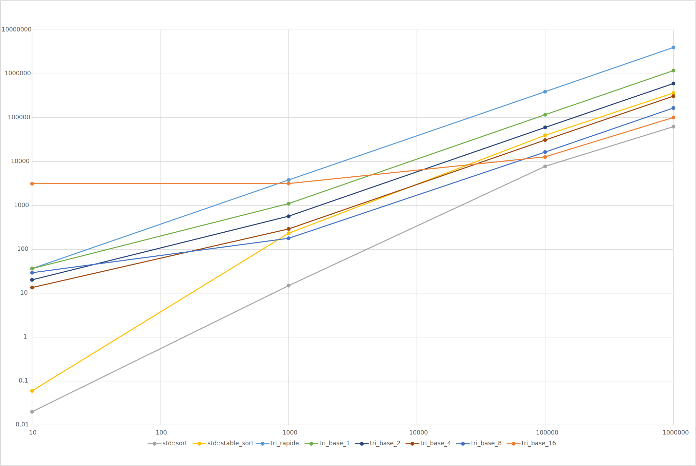

# L3 - Tris

## Mesures
Il nous a été demandé de faire des mesures de nos algorithmes implémentés ainsi que de ceux mis à disposition
par la STL.

Voici nos résultats :

Nous pouvons donc en tirer :
- Le tri par base 16 possède un cout constant très haut, probablement dù à la taille du vecteur de 
clé qu'il doit générer. On le voit être quasiment constant jusqu'à 1000 valeurs dans le vecteur.
Cependant, nous voyons que dès que le nombre de valeurs approche les 100'000 celui-ci devient le deuxième tri
le plus efficace.
- Les tris mis à disposition par la STL sont clairement plus optimisés que les nôtres. Cela reprend l'idée
que nous avions vue lors du premier laboratoire ou nous avions testé les
différents tris de la STL.
- En général, le tri en base 8 semble être d'une taille correcte pour avoir une performance raisonnable.

## Analyse du tri par base
Le tri par base est un tri qui n'est pas en place donc qui demande de la mémoire pour créer des tableaux intermédiaires.
De ce fait, nous aurons un coût mémoire lié à la base que nous choisissons, plus la base est grande plus le tableau devra
l'être. Sur le graphique que nous avons ci-dessous, nous remarquons que le tri par base est plus lent que les tris mis à
disposition par la STL cependant, il reste plus rapide que le tri rapide.

On remarque que plus la base est grande, plus le coût initial est haut, mais le moins l'ajout de nouveaux éléments
influence la fonction. Cela est probablement dû au cout élevé de l'initialisation et de l'allocation du vecteur temporaire.

**Complexité**

$$
O(d(n+k))
$$

Pour un tableau de taille `n` d'éléments encodés sur `d` bits pouvant prendre `k` valeurs possibles.

## Analyse du tri rapide
Le tri rapide est un tri qui fonctionne avec des valeurs de pivot et va trier le tableau en prenant portion du tableau
par portion. Il a l'avantage d'être en place donc n'utilise pas de sous-tableaux et n'aura donc pas un cout mémoire palier
élevé.

**Complexité**

Pire cas

$$
O(n^2)
$$

Meilleur cas

$$
O(n * \log{n})
$$

Pour un tableau de `n` éléments